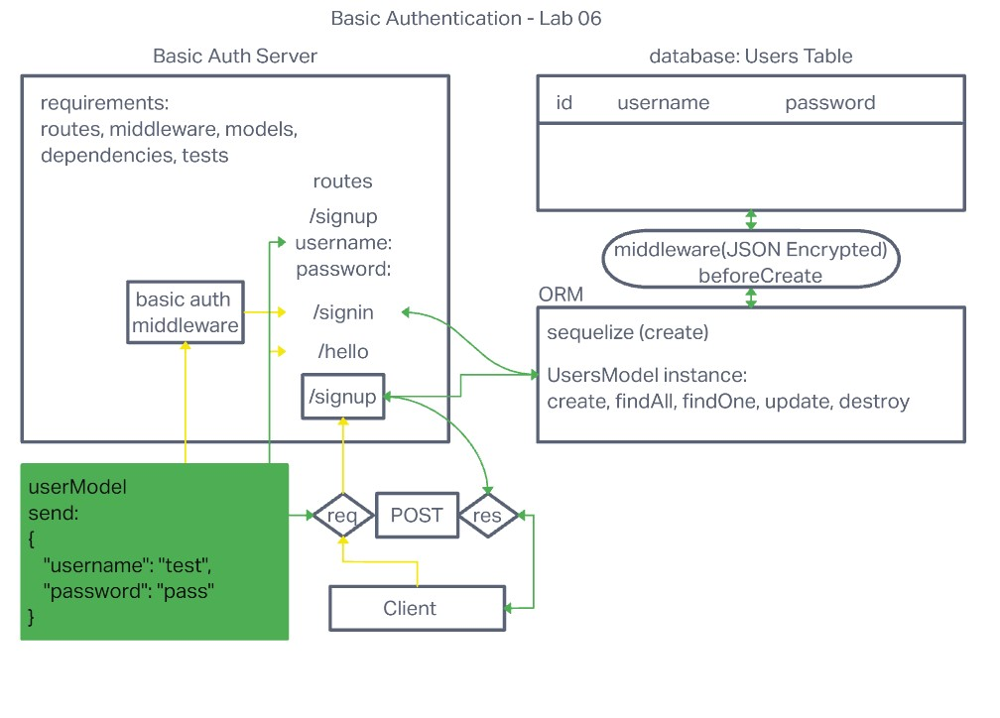

# Project: Basic Auth

## Author: Robert Ball

### Code 401d48 Lab 06

### Problem Domain

* Deploy an Express server that implements Basic Authentication, with sign-up and signin capabilities, using a Postgres database for storage.

Deployed production server: [Heroku - RDBALL Basic Auth](https://rball-basic-auth.herokuapp.com/)

---
Requirements:

* As a user, I want to create a new account so that I may later login
  * Using an HTTP REST client or a web form
  * Make a POST request to the/sign-up route with username and password
  * Your server should support both JSON and FORM data as input
  * On a successful account creation, return a 201 status with the user object in the body
  * On any error, trigger your error handler with an appropriate error

* As a user, I want to login to my account so that I may access protected information
  * Using am HTTP REST client, or a web form
  * Make a POST request to the /signin route
  * Send a basic authentication header with a properly encoded username and password combination
  * On a successful account login, return a 200 status with the user object in the body
  * On any error, trigger your error handler with the message “Invalid Login”

---

Testing:

* POST to /sign-up to create a new user
* POST to /signin to login as a user (use basic auth)
* Need tests for auth middleware and the routes
  * Does the middleware function (send it a basic header)
  * Do the routes assert the requirements (sign-up/signin)

Documentation:



Dependencies

```JSON

{
  "base-64": "^1.0.0",
  "bcrypt": "^5.0.1",
  "cors": "^2.8.5",
  "dotenv": "^16.0.2",
  "eslint": "^8.24.0",
  "express": "^4.18.1",
  "jest": "^29.0.3",
  "pg": "^8.8.0",
  "sequelize": "^6.23.1",
  "sequelize-cli": "^6.4.1",
  "sqlite3": "^5.1.1",
  "supertest": "^6.2.4"
}
```

Setup

1. Create repo or fork this repo
2. Add README
3. Add .gitignore for Node
4. Add the license of your choice
5. Clone repo to your local system
6. with the repo open in your editor of choice, run:

```code
npm init -y
install dependencies
```

When your server is not running, use the command

```code
npm test
```
